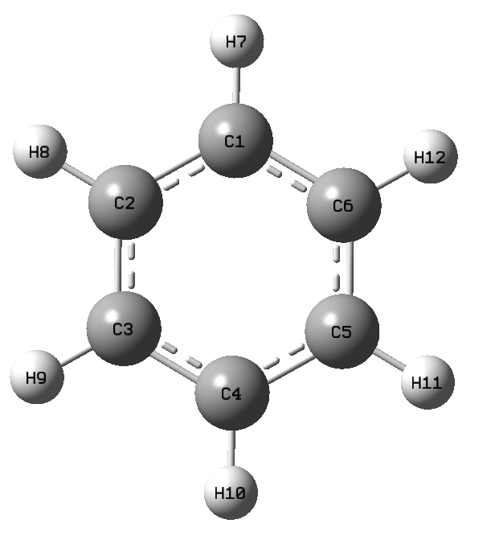

Example1
--------
**Overview**
============
This example shows how to build a topology for a benzene molecule.

.. code-block:: python

	import topology as top
	# Number of atoms of the molecule
	natoms = 12  # 6C and 6H
	# List of all bonds
	bond_list = [[0, 1], [0, 2], [0, 5], [0, 6], [1, 2],
          	    [1, 7], [2, 3], [2, 8], [3, 4], [3, 9],
	              [4, 10], [5, 11]]
	# Create a topology
	t = top.Topology(natoms=natoms, listbonds=bond_list)

